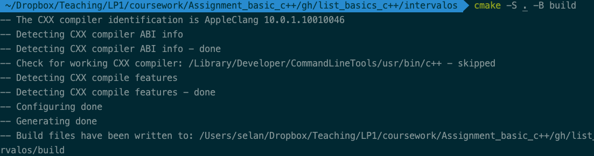
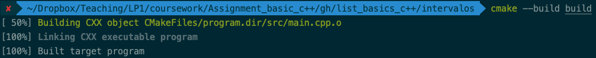
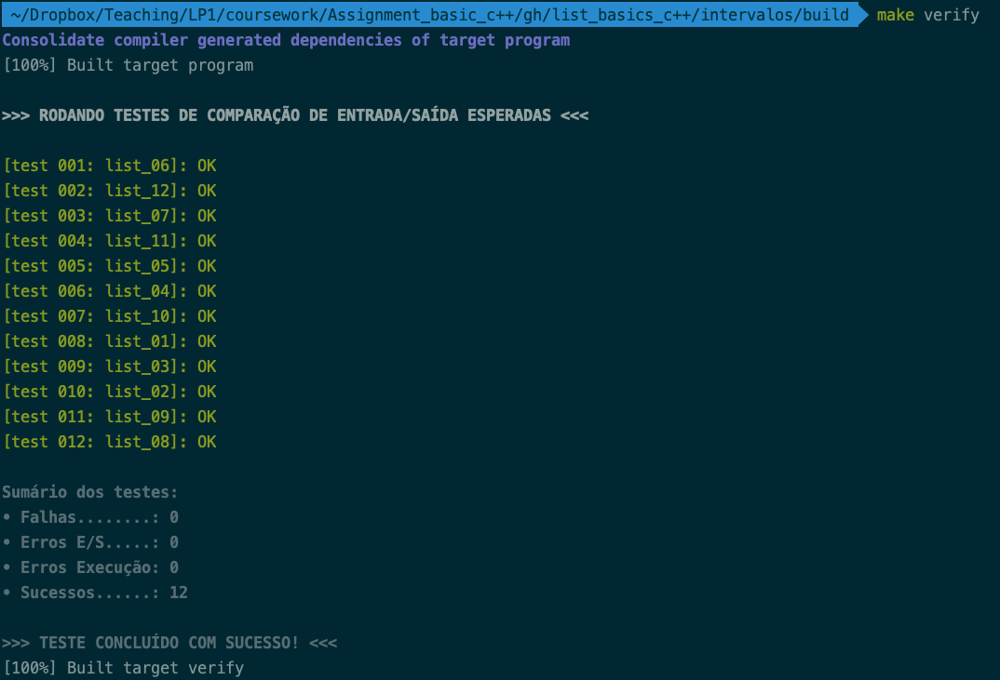
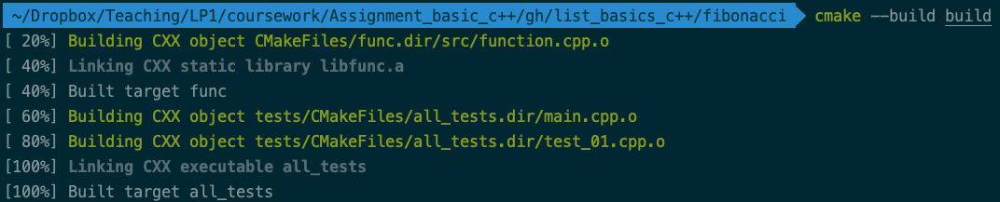
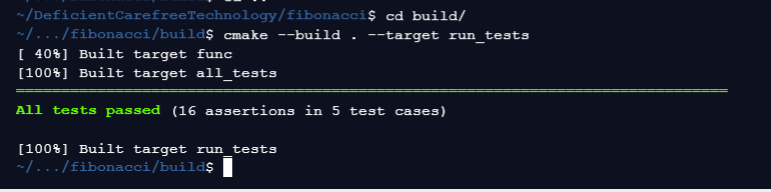

# Trabalho 01: Lista básica de programação em C++


#  Introdução

Esse exercício tem por objetivos fazer você praticar sua habilidade de **interpretar especificações de problemas**, aliada a sua capacidade de **projetar** e **implementar algoritmos**.

Além disso, o desenvolvimento desse trabalho oferecer uma oportunidade prática para utilizar elementos básicos de programação em C++, como laços, condicionais simples e composto, tipos de dados básicos e heterogêneos, expressões lógicas, passagem de parâmetros, criação de funções, leitura de escrita de informações a partir da entrada e saída padrão, dentre outros.

Adicionalmente, você deverá ter contato com alguns elementos da STL (_Standard Template Library_) do C++, mais especificamente o uso de _vetor dinâmico_ e _estático_, bem como alguns algoritmos básicos de manipulação de dados, dependendo das necessidades dos algoritmos que você projetar.

# Suas Tarefas

As tarefas a serem implementadas correspondem a cada um dos diretórios neste repositório (exceto os diretórios `scripts` e `pics`) sendo elas:

- [negativos5](./negativos5)
- [soma_vizinhos](./soma_vizinhos)
- [intervalos](./intervalos)
- [fibonacci](./fibonacci)
- [minmax](./minmax)
- [inverter](./inverter)
- ~~[filter](./filter)~~ (respostas no arquivo [filter_students.cpp](filter./src/filter_students.cpp))
- [ponto_em_retangulo_1](./ponto_em_retangulo_1)
- [ponto_em_retangulo_2](./ponto_em_retangulo_2)


Para facilitar a implementação de suas respostas, você vai encontrar nesse repositório o código de suporte organizado em várias pastas, uma para cada questão da lista. Esse código já está preparado para compilar cada projeto individualmente através do uso de `cmake` e contém indicações sobre o que você precisa alterar através de comentários como `// TODO` espalhados por alguns arquivos `.cpp` e `.h`. Para você usufruir dessa infraestrutura de compilação e testagem disponível, é importante que você **não altere nenhum arquivo além do que for indicado nesse documento**.

Em resumo, sua tarefa consiste em:
1. Implementar todos as questões requisitadas na lista, incluindo seu código nos locais apropriados em cada pasta.
2. Editar o arquivo [`autor.md`](autor.md) e adicionar suas informações pessoais na [Seção Identificação Pessoal](autor.md/#identificação-pessoal).
3. Marcar cada uma das questões que você conseguiu resolver, na [Seção Questões Finalizadas](autor.md/#questões-finalizadas) do arquivo [`autor.md`](autor.md).

# Compilando e Executando

Nessa seção abordamos o procedimento necessário para compilar e executar o código inicial fornecido com o exercício.

## Tipos de Questões
Existem duas categorias de exercícios: implementação de **programa** e implementação de **função**.

Para os exercícios que solicitam a implementação de um programa, você deve editar apenas o arquivo `src/main.cpp`. Se você desejar criar outros arquivos `.cpp` para modularizar melhor seu projeto você pode fazê-lo; nesse caso lembre-se de alterar o script do `cmake` correspondente de maneira a incluir o novo arquivo fonte na lista de dependências do target `${APP_NAME}` com o comando `target_sources( ${APP_NAME} PRIVATE "seu_arquivo.cpp" )`.

Nesta categoria você deve assumir que os dados de entrada para cada programa são lidos da **entrada padrão**, stdin, através da _operação de extração_(**>>**) do _objeto_ `std::cin`. Similarmente, a saída do programa deve ser enviada para a saída padrão, stdout, através do operador de _inseção_(**<<**) no _objeto_ `std::cout`.

```c++
int x;
std::cin>>std::ws>>x; //equivalente à scanf(" %d",&x);
std::cout<<x<<'\n'; //equivalente à scanf("%d\n",x);
```

Para os exercícios que solicitam a implementação de uma função, você precisa apenas editar o arquivo `src/function.cpp`. Lá você vai encontrar o corpo vazio da função que precisa ser desenvolvida. Neste caso, é importante que você não mude a assinatura da função específica, assim os testes automáticos funcionarão.

No geral é importante que você siga à risca as instruções sobre a implementação dos exercícios, uma vez que as respostas são validadas de forma automática. De preferencia, não modifique qualquer coisa nos testes automáticos, a memos que seja acordado com o professor.

## Dependências (precisam ser instalados no seu ambiente)

Para você poder compilar e executar os testes preparados para o exercício é necessário os seguintes requisitos:
+ [GNU gcc](https://gcc.gnu.org/), [clang](https://clang.llvm.org/), ou outro: compilador C++.
+ [cmake](https://cmake.org/): para gerar os arquivos _Makefiles_, que gerenciam a compilação otimizada do projeto.
+ [Python 3.0](https://www.python.org/): para executar o script de teste de comparação de saída gerada/esperada. Teste no seu terminal se o comando `python3 --version` funciona!.

## Instruções Categoria Implementação de Programa

Vamos considerar que desejamos compilar e testar o projeto `Intervalos`, que requer a criação de um programa. Cada pasta de projeto que requer um programa como resposta está organizado da seguinte forma:
```
+─intervalos          ---> Nome da posta do projeto
  ├─── CMakeLists.txt ---> Script de configuração do cmake.
  ├─── build          ---> Pasta onde os executáveis serão gerados. [será criada]
  ├─── data_expected  ---> Pasta que contém os arquivos de saída com as respostas corretas.
  ├─── data_in        ---> Pasta que contém os arquivos de entrada para os testes.
  └─── src            ---> Pasta que contém arquivo que você precisa editar.
       └─── main.cpp  ---> Arquivo que precisa ser alterado para conter sua resposta. [editar]
```

A partir da pasta que contém as subpastas de cada questão faça:

1. Edite o arquivo `intervalos/src/main.cpp` e implemente a solução do problema.
2. Entre na pasta do projeto, no caso `intervalos`:
```
cd intervalos
mkdir build
cd build
```
3. Execute o comando do `cmake` para gerar os arquivos intermediários. Esse comando cria a pasta `build` que conterá os arquivos _Makefile_ e onde o executável será gerado.
```
cmake ../
```
Possível saída:

<!--  -->


4. Execute o comando do `cmake` para **compilar** o projeto `intervalos` dentro da pasta `build`. Esse comando criará um executável dentro de `build` chamado (de forma genérica) de `program`.
```
cmake --build .
```
Possível saída:

<!--  -->


5. Se houver erro de compilação, corrija e volte ao passo anterior. Se a compilação for bem sucedida, prossiga com o comando abaixo para entrar na pasta `build` e rodar os testes.
```
cmake --build . --target verify
```
6. Observe os resultados dos testes do passo anterior. Se algum teste falhar você deve corrigir o problema e compilar o projeto novamente, como descrito no passo 4. Se você estiver na pasta `build` e desejar compilar novamente, pode executar os comandos abaixo, ao invés de retornar ao passo 4 (que deve ser executado de fora do `build`)
```
cmake --build . --target verify
```
Se os testes forem bem sucedidos, você deve encontrar uma saída como essa abaixo:

<!--  -->


## Instruções Categoria Implementação de Função

Vamos considerar que desejamos compilar e testar o projeto `Fibonacci`, que requer a criação de uma função. Essa pasta está organizada da seguinte forma:
```
+─fibonacci               ---> Nome da posta do projeto
  ├─── CMakeLists.txt     ---> Script de configuração do cmake.
  ├─── build              ---> Pasta onde os executáveis serão gerados. [será criada]
  ├─── tests              ---> Pasta que contém os arquivos de teste unitário.
  └─── src                ---> Pasta que contém arquivo que você precisa editar.
       ├─── function.h    ---> Arquivo cabeçalho com definição da assinatura da função. 
       └─── function.cpp  ---> Arquivo que precisa ser alterado para conter sua resposta. [editar]
```

1. Edite o arquivo `fibonacci/src/function.cpp` e implemente a solução do problema.
2. Entre na pasta do projeto, no caso `fibonacci`:
```
cd fibonacci
mkdir build
cd build
```
3. Execute o comando do `cmake` para gerar os arquivos intermediários. Esse comando cria a pasta `build` que conterá os arquivos _Makefile_ e onde o executável será gerado.
```
cmake ../
```
4. Execute o comando do `cmake` para **compilar** o projeto `fibonacci` dentro da pasta `build`. Esse comando criará dentro da pasta `build` uma biblioteca estática contendo a sua função, `libfunc.a`, e um executável para executar os testes unitários, `tests/all_tests`.
```
cmake --build .
```
Possível saída:

<!--  -->


5. Se houver erro de compilação, corrija e volte ao passo anterior. Se a compilação for bem sucedida, prossiga com o comando abaixo para entrar na pasta `build` e executar o comando:

```
cmake --build . --target run_tests
```

6. Observe os resultados dos testes do passo anterior. Se algum teste falhar você deve corrigir o problema e compilar o projeto novamente, como descrito no passo 4. Se você estiver na pasta `build` e desejar compilar novamente, pode executar os comandos abaixo, ao invés de retornar ao passo 4 (que deve ser executado de fora do `build`) no linux:
```
cmake --build . --target run_tests
```

Se os testes forem bem sucedidos, você deve encontrar uma saída como essa abaixo:

<!--  -->


# Submissão das Respostas

A submissão deve ser feita através do Sigaa, conforme explicitado na turma, bem como usando o seu repositório do github correspondente.

--------
&copy; DIMAp/IMD/UFRN 2021.
